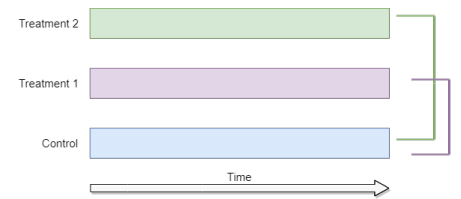
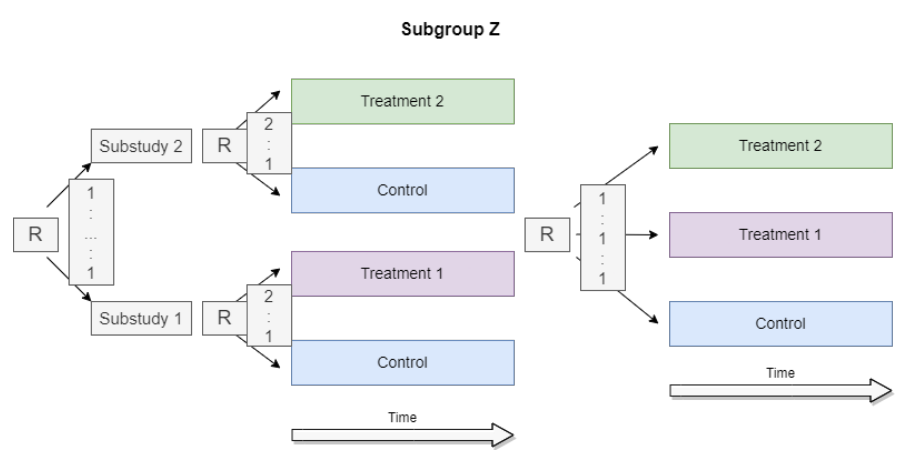
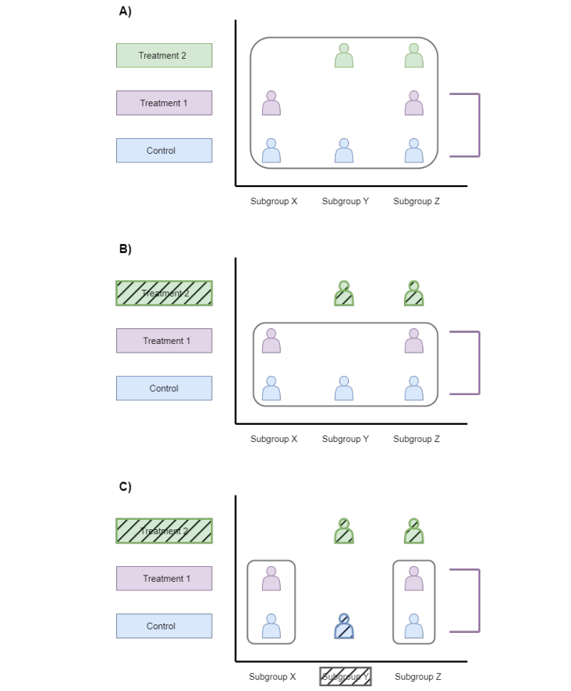

# **Design issues in multi-arm trials**

This repository contains the main code and R functions to reproduce the results of the simulation study presented in my [master thesis](https://zenodo.org/records/10533916) which has the title "Design issues in multi-arm trials".  

## Abstract

Multi-arm trials enhance drug development by offering increased flexibility and efficiency compared to traditional randomized clinical trials. The treatment efficacy in multi-arm trials is often assessed by comparing multiple treatment arms against a shared control arm. In traditional multi-arm studies, it is generally necessary for all enrolled patients to be eligible for all treatments in the trial. However, there are situations where this requirement may not be feasible, for example, treatments may not be available at all study centres. Selective exclusion of treatment arms can be considered as a solution in such cases, allowing clinicians and patients to exclude an unsuitable treatment arm. It is important to carefully consider the implications of the selective exclusion on the overall design and analysis of the trial. A key issue is which control data can be utilized and how to address the selective subgroups. To utilize different patient populations, it has been suggested to use randomization procedures in the trial which are capable of randomizing the patients between limited subsets of interventions according to the patient background, patients preference or treatment options at the study centres.

This thesis aims to enhance the methodology for optimally utilizing different patient subgroups in the analysis of a multi-arm trial while considering different compositions of control data. It was of further interest to evaluate the analysis strategy, the randomization strategy and the distribution of the different patient populations. The results from a simulation study are presented, where the performance of the proposed approaches in terms of the type I error rate and statistical power was evaluated under a wide range of scenarios. The results from the simulation study indicate that the analyses where the different patient subgroups were not adjusted for can lead to a substantial power loss and type I error inflation as bias in the effect estimates is introduced. Therefore, the usage of adjusted analyses is recommended. Furthermore, the results show that the preferred randomization strategy implies an equal ratio for treatment arm vs. control arm within each subgroup. Regarding the different composition of control data, the preferred analysis strategy is to base the comparisons on the patients who could have been directly randomized to one of the arms which are of interest for the comparison.

## Simulation Setup

For the simulation study a multi-arm trial with two experimental treatment arms that enter the trial at the beginning of the trial and a shared control arm is considered (see Figure).

The recruitment of the control arm and the two treatment arms start at the beginning of the trial and patients are recruited during the whole observation period. The considered multi-arm trial allows the selective exclusion of treatment arms. Since a trial with three arms is considered, this results in three different patient subgroups X, Y and Z:
* subgroup X: patients eligible to only treatment 1,
* subgroup Y: patients eligible to only treatment 2,
* subgroup Z: patients eligible to both treatments.

In this thesis, the distribution of patients in the three subgroups X, Y and Z is referred to with the word prevalence. For the distribution to the subgroups, a random prevalence distribution as well as a deterministic prevalence distribution was tested. It was distinguished between three settings
for the prevalence to the subgroups in which the design is varied according to the objectives of the simulation study:
* **Setting 1**: a prevalence of 0:0:1 to the subgroups X, Y and Z is considered. It illustrates the extreme case where all patients are in subgroup Z. As subgroup Z represents the subgroup in which patients can get randomized to all three arms, this setting is equivalent to a study design that does not allow for selective exclusion of treatment arms, i.e. the setting does not consider different patient populations. The setting corresponds to a traditional multi-arm design (see Figure above).
* **Setting 2**: a prevalence of 0.5:0.5:0 to the subgroups X, Y, Z is regarded. It illustrates the second extreme case where patients get recruited from subgroups X and Y. This setting corresponds to two completely independent substudies.
* **Setting 3**: patients get recruited from all three subgroups X, Y and Z. For that different prevalence to the three subgroups are considered:
  * an equal prevalence of $\frac{1}{3}:\frac{1}{3}:\frac{1}{3}$ to the subgroups X:Y:Z,
  * an unequal prevalence of $\frac{1}{4}:\frac{1}{4}:\frac{1}{2}$ to the subgroups X:Y:Z,
  * a high prevalence to subgroups X and Y with $\frac{2}{5}:\frac{2}{5}:\frac{1}{5}$ to the subgroups X:Y:Z,
  * a low prevalence to subgroups X and Y with $\frac{1}{10}:\frac{1}{10}:\frac{4}{5}$ to the subgroups X:Y:Z.

For the remainder of this thesis the following abbreviations will be used to refer to the three treatment arms: T1 for treatment 1, T2 for treatment 2 and C for control. For the three prevalence settings, scenarios with different randomization strategies to the three arms were considered (see
Table below):
* **R-I**: for subgroups X and Y the ratio is 2:1 for T1 vs. C and T2 vs. C and for subgroup Z the ratio is 1:1:1 for T1 vs. T2 vs. C.
* **R-II**: for subgroups X and Y a ratio of 1:1 within the substudies for T1 vs.C and T2 vs. C is assumed while for subgroup Z a ratio of 1:1:2 for T1 vs.T2 vs. C.
* **R-III**: an equal ratio within each subgroup is assumed, meaning that forsubgroup Z the ratio is 1:1:1 for T1 vs. T2 vs. C and for subgroups X and Y the ratio is 1:1 for T1 vs. C and T2 vs. C.

Randomization Strategy/ Subgroup  | R-I | R-II | R-III|
------------- | ------------- | -------------| -------------|
Subgroup X  | 2:1 ratio for T1 vs. C| 1:1 ratio for T1 vs. C| 1:1 ratio for T1 vs. C|
Subgroup Y | 2:1 ratio for T1 vs. C| 1:1 ratio for T1 vs. C | 1:1 ratio for T1 vs. C|
Subgroup Z |1:1:1 ratio for T1 vs. T2 vs. C| 1:1:2 ratio for T1 vs. T2 vs. C| 1:1:1 ratio for T1 vs. T2 vs. C|
  
Within the substudies, patients are randomized to the different arms with either complete randomization or block randomization. The block size depends on the randomization strategy: for **R-I** a block size of 3 was chosen for all three subgroups. The idea was to thereby allocate more subjects to the treatment arm in subgroups X and Y. For **R-II** a block size of 2 for subgroups X and Y was chosen and for subgroup Z a block size of 4. As result, overall more patients are randomized to the control arm. In **R-III** a block size of 2 was chosen for subgroups X and Y and a block size of 3 for subgroup Z to achieve an equal ratio within each subgroup. For simplicity the smallest block size that meets the desired ratio for each randomization strategy was chosen for the simulation.

To generate the trial data, different total sample sizes are considered (n = 30, 75, 150, 300). The sample size per arm is influenced by the different randomization strategies introduced above. For example, for **R-I** the sample size per arm for a total sample size of 150 is 50 while for **R-II** the sample size per arm for a total sample size of 150 is, for example, 37:38:75 for T1 vs. T2 vs. C. The stopping criterion after which the analysis is conducted is that the total number of patients is enrolled in the trial.

The continuous outcome $Y_{ij}$ for the patients in treatment arm $i$ and subgroup $j$ is drawn from a normal distribution according to: 
    $Y_{ij} \sim N(\mu^i_j, \sigma^2)$ where $i \in \{T1, T2, C\}$ and $j \in \{X, Y, Z\}$,
with 
    $\mu^i_j = \Delta^i_j + \mu^C_{j}$ for $i \in \{T1, T2\}$
and 
    $\sigma^2$ = 1,
where $\mu^C_{j}$ is the response in the control arm and $\Delta^i_j$ the effect of treatment i in subgroup j. For the sake of simplicity the variances are assumed to be equal to 1. Moreover, different cases for the treatment effects were considered in the simulation study: 

* **Case 1**: the treatment effects in the subgroups are the same: $\Delta_X^{T1}$ = $\Delta_Z^{T1}$ and $\Delta_Y^{T2}$ = $\Delta_Z^{T2}$,
* **Case 2**: the treatment effects in the subgroups are different: $\Delta_X^{T1}$ $\neq$ $\Delta_Z^{T1}$ and $\Delta_Y^{T2}$  $\neq$ $\Delta_Z^{T2}$.

In the considered trial design, the patients are randomized to different experimental treatment options and the hypotheses are being tested independently which does not require multiplicity correction [^1]. Since the hypotheses are being tested independently, no adjustment for the level-α-test for the multiple hypotheses testing was performed. 

For one prevalence setting approximately 15000 different simulation scenarios were considered. 10000 replicates of each scenario were generated to estimate the operating characteristics of interest. The empirical proportion of times when the null hypothesis is rejected provides us with an estimate of the type I error rate (when the null hypothesis is true) or the power (when the alternative hypothesis is true). The following table summarizes the considered simulation scenarios and parameters. 

Name  | Investigated values | Description
------------- | -------------| -------------
Number of treatment arms  | 2 | Number of treatment arms that get compared to the shared control arm.
Sample size | n = 30, 75, 150, 300 | Total sample size after which analysis is conducted. The sample size in the subgroups is influenced by the prevalence and in the arms by the randomization strategy.
Randomization method | Complete randomization, block randomization | Patients are randomized by complete or block randomization to the different arms.
Prevalence | Setting 1: 0:0:1, Setting 2: 0.5, 0.5, 0, Setting 3:  $\frac{1}{3}:\frac{1}{3}:\frac{1}{3}$, $\frac{1}{4}:\frac{1}{4}:\frac{1}{2}$,  $\frac{2}{5}:\frac{2}{5}:\frac{1}{5}$ , $\frac{1}{10}:\frac{1}{10}:\frac{4}{5}$  | Distribution of patients in the three different subgroups X, Y and Z.
Standard deviation | $\sigma$ = 1 | For simplicity is the standard deviation for the normally distributed random outcome variables the same for all subgroups and treatment arms. 
Treatment effect T1| Case 1: $\Delta_X^{T1}$ = $\Delta_Z^{T1}$, Case 2: $\Delta_X^{T1}$ $\neq$ $\Delta_Z^{T1}$ | Treatment effect for T1 vs. C in both subgroups X and Z.
Treatment effect T2  | Case 1: $\Delta_Y^{T2}$ = $\Delta_Z^{T2}$, Case 2: $\Delta_Y^{T2}$ $\neq$ $\Delta_Z^{T2}$ | Treatment effect for T2 vs. C in both subgroups Y and Z.
Significance level  | $\alpha$ = 2.5% | Significance level for one-sided testing of the pairwise comparisons. 

### Hypotheses of interest
The above mentioned approach of only performing pairwise comparisons of treatment arms after a significant overall heterogeneity test would imply for the design at hand, when following Law`s recommendation [^2] and basing the comparisons of treatment vs. control only on the patients who are directly randomized between the two arms, that only the patients who are enrolled in subgroup Z (the overall randomization) would be included in the overall heterogeneity test. That is not efficient and not the appropriate approach for analysing the study design of the simulation. Therefore, pairwise comparisons are performed as not all recruited patients are included in all comparisons. For the pairwise comparison of T1 vs. C and T2 vs. C, contrasts for each considered scenario are calculated based on the linear model which would be estimated for the ANOVA. For the case where one does not adjust for the subgroups, it is of interest how the factor treatment arm (T1, T2, C) affects the response variable outcome. For the two-way ANOVA the two factors treatment arm (T1, T2, C) and type of subgroup (X, Y, Z) are taken into account and thereby, one adjusts for the subgroups. The interaction of the two factors was not considered.\newline

The following one-sided hypotheses are considered (rejecting at significance level $\alpha = 0.025$) for the pairwise comparisons of interest, where $\mu_{T1}$ is the mean in T1, $\mu_{T2}$ the mean in T2 and $\mu_{C}$ the mean in C.

H0: $\mu_{T1} = \mu_C$ and H1: $\mu_{T1} > \mu_C$, 

H0: $\mu_{T2}$ = $\mu_C$ and H1: $\mu_{T2} > \mu_C$.

Since the hypothesis is that the mean of the treatment arm is higher than the mean of the control arm, the contrast for T1 vs. C is determined as follows: 

$\Lambda_1$ = $1 * \mu_{T1} + 0 * \mu_{T2} -  1 * \mu_{C}$. 

The sign of the weights must correspond to the direction in the hypothesis and the weight for the arm which is not included in the comparison is set to 0. The chosen weights for the statistics are 1 and -1. The contrast for the comparison of T2 vs. C is respectively:

$\Lambda_2$ = $0 * \mu_{T1} +$ $1 * \mu_{T2} - 1 * \mu_{C}$.

### Data Selection
In the analysis, the impact of the composition of the control data is of interest and the above defined contrasts are calculated for the three different control data compositions. First, all data are considered for the analysis, depicted in Figure A). That means that the full data set is regarded, e.g. regardless whether the patients were in the subgroup or arm of interest for the comparison they are included for the comparisons. Next, all control data are regarded, see Figure B), which means that the control data of all patients are used for the analysis independent of the subgroup they were recruited from. For example, for a comparison of T1 vs. C, one would also include the control data of patients in subgroup Y who never had the chance of getting treated with T1. Finally, restricted data are taken into account, represented in Figure C), which refers to the patients who had the chance of getting treated with the treatment of interest. For a comparison of T1 vs. C, one would only use the data of patients in subgroups X and Z who were randomized to either T1 or C.

## R Functions
The folder *functions* contains all R functions necessary to reproduce the results in the thesis and supplementary material:

* determineDataset.R: the function for generating the data set includes the assignment to the three different subgroups X, Y and Z, the randomization to the three arms T1, T2 and C, the splitting of the data sets into all data, all control data and restricted and the adjusted and unadjusted analyses.

* callSimulation.R: the estimates and p-values over the iterations are collected and the operating characteristics such as power, bias and confidence intervals are calculated. Besides, the iterations are parallelized to accelerate the simulating process.

* runSimulation.R: a grid is build which consists of all simulation parameters of interest. Then, for each row of the grid one iterates over determineDataset.R and callSimulation.R. In the end, the data are saved as csv file and one row in the csv file corresponds to one row in the grid, i.e. one simulation scenario.

## Funding
The work for this thesis was carried out at the Center for Medical Data Science of the Medical University of Vienna. This work was part of the EU-Pearl (EU Patient-cEntric clinicAl tRial pLatforms) project which has received funding from the Innovative Medicines Initiative (IMI) 2 Joint Untertaking under grant agreement No 853966. This Joint Untertaking received support from the European Union´s Horizon 2020 research and innovation program and EFPIA and Children´s Tumor Foundation, Global Alliance for TB Drug Development non-profit organization, Springworks Therapeutcs Inc. This thesis reflects the author‘s point of view. Neither IMI nor the European Union, EFPIA, or any Associated Partners are responsible for any use that may be made of the information contained herein.

[^1]: . Howard, J. Brown, S. Todd, and W. Gregory. “Recommendations on multiple testing adjustment in multi-arm trials with a shared control group”. Statistical Methods in Medical Research, vol. 27, no. 5 (2018), pp. 1513–1530.
[^2]: . Law and S. Emery. “Selective exclusion of treatment arms in multi-arm randomized clinical trials”. Statistics in Medicine, vol. 22, no. 1 (2003), pp. 19–30.
